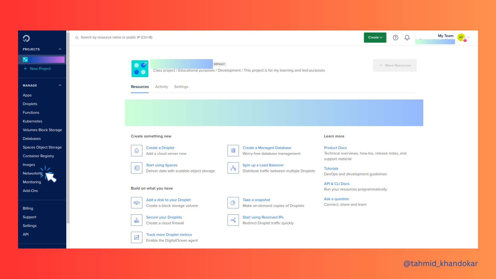

# Firewall Setup on Digital Ocean

After setting up a cloud server, it is essential to create a firewall to protect our valuable server. This is a necessary step, so let's learn how to set up a firewall in Digital Ocean:

To get started, please sign in to your dashboard and go to the Network section from the menu on the left-hand side.

Then you may see some options, from there you need to go to Firewall.

When you navigate to the Firewall section, you will find a button labeled `Create Firewall`. Clicking on it will take you to a new page where you can configure your firewall settings based on your specific needs. You have the option to set up custom inbound and outbound rules for your IP addresses, which can provide an additional layer of security to your server.

Once you have identified your requirements, proceed to set up the firewall using `Create Firewall` green button at the bottom.

There, you go! Your personal firewall has been set up successfully.

**#Happy_Learning**
